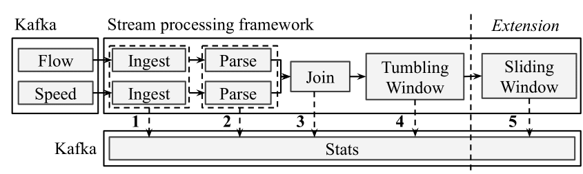

# Open stream processing benchmark

This repository contains the code of the open stream processing benchmark.

It includes both the data stream generator to run the benchmark and the benchmarking code itself.

Currently the benchmark includes Apache Spark (Spark Streaming and Structured Streaming), Apache Flink and Kafka Streams.

## Processing pipeline
This repository contains code for benchmarking Stream Processing frameworks. Four frameworks were included being Spark Streaming, Structured Streaming, Flink and Kafka Streams.
A pipeline of common IoT operations has been implemented:

The data-stream-generator publishes a configurable volume of data onto two Kafka topics (ndwflow and ndwspeed). The default volume of the data stream is 760 messages per second (380 messages per topic) which equals to 1 368 000 messages per 30 minutes.

The flow of operations done in the benchmark is as follows:

   1. Ingest: Read JSON event data from Kafka from two input streams: speed stream and flow stream.
   2. Parse: Parse the data from the two streams and extract useful fields.
   3. Join: we join the flow stream and the speed stream together.
            The join will happen based on the key: measurement id + internal id + timestamp.
            This internal id describes the lane of the road.
            By joining this we know how many cars passed and how fast they drove
            on a certain lane at a certain time point.
   4. Tumbling window: we aggregate the speed and the flow over all
                   the lanes belonging to the same measurement ID. So here the data is grouped by measurement ID + timestamp. For the speed, we compute the average speed over all the lanes and for the flow, we compute the accumulated flow over all the lanes. We then know how fast cars drove past the measurement
                    point on average and how many cars passed in the last time period.
   5. Sliding window: For the windowing phase, we will compute the relative change in flow and speed over two lookback period: a short one and a long one. The length of the lookback periods is defined in the benchmarkConfig.conf file. The relative change is calculated by computing:

                             speed(t) - speed(t-1) / speed(t-1)

   6. Publishing output back to Kafka

## Running the benchmark locally
To run the benchmark, the following services need to be installed and brought up:
- SBT
- Zookeeper
- Kafka
- Data stream generator: publishes traffic data on Kafka.
- Benchmark-suite of framework

### Zookeeper
Install Zookeeper: https://zookeeper.apache.org/doc/r3.1.2/zookeeperStarted.html

Start zookeeper at localhost:2181.

### Kafka
Install Kafka by downloading it from:
https://archive.apache.org/dist/kafka/2.1.0/kafka_2.11-2.1.0.tgz 

Extract it and place it in a folder: f.e. ~/opt/
Replace config/server.properties with the server.properties file in the folder kafka-cluster-tools in this repository. This file has some changes such as the listeners, delete.topic.enable and auto.create.topics.enable.

In kafka-cluster-tools/start-local-kafka-cluster.sh replace the second line with the appropriate path for Kafka:
  export KAFKA_HOME=~/opt/kafka_2.11-2.1.0

Then start up the local Kafka server and create the flow, speed and metrics topics by running the script:

    ./kafka-cluster-tools/start-local-kafka-cluster.sh

### Data Stream Generator
Set the following environment variables:

    export KAFKA_BOOTSTRAP_SERVERS="localhost:9092"
    export DATA_VOLUME=0 # the inflation factor for the data
    export MODE="constant-rate" # or "periodic-burst"
    export FLOWTOPIC="ndwflow" # topic to publish flow events onto
    export SPEEDTOPIC="ndwspeed" # topic to publish speed events onto

Compile the data stream generator with SBT by:

    sbt compile

Run the data stream generator with:

    sbt run

### Benchmark 

Set the following environment variables:

    export DEPLOYMENT_TYPE=local

Go to the folder benchmark 

    cd benchmark

Start sbt

    sbt

Go to the project you want to run:

    project flink-benchmark # other options are spark-benchmark, structured-streaming-benchmark or kafka-benchmark

    run

## References and Publications
- [van Dongen, G., & Van den Poel, D. (2020). Evaluation of Stream Processing Frameworks. IEEE Transactions on Parallel and Distributed Systems, 31(8), 1845-1858.](https://ieeexplore.ieee.org/abstract/document/9025240)
The Supplemental Material of this paper can be found [here](https://s3.amazonaws.com/ieeecs.cdn.csdl.public/trans/td/2020/08/extras/ttd202008-09025240s1-supp1-2978480.pdf).

- Earlier work-in-progress publication:
[van Dongen, G., Steurtewagen, B., & Van den Poel, D. (2018, July). Latency measurement of fine-grained operations in benchmarking distributed stream processing frameworks. In 2018 IEEE International Congress on Big Data (BigData Congress) (pp. 247-250). IEEE.](https://ieeexplore.ieee.org/document/8457759)

Talks related to this publication: 

- Spark Summit Europe 2019: [Stream Processing: Choosing the Right Tool for the Job - Giselle van Dongen](https://www.youtube.com/watch?v=PiEQR9AXgl4&t=2s)
